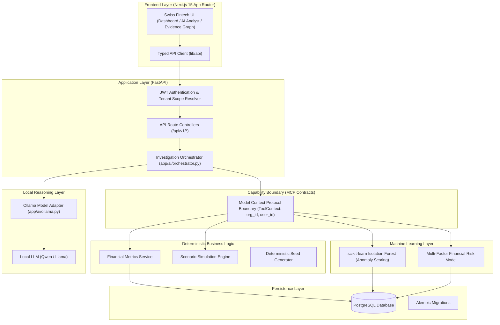

# FINController

### An AI-native financial control tower that investigates why money moves — not just what moved.

[](https://python.org)
[](https://fastapi.tiangolo.com)
[](https://nextjs.org)
[](https://postgresql.org)
[](https://alembic.sqlalchemy.org)
[](https://scikit-learn.org)
[](https://ollama.ai)
[](https://astral.sh/ruff)
[](https://pytest.org)

---

## 1. Five-Minute Overview

Modern financial systems produce massive streams of transaction telemetry: payment attempts, gateway response codes, refund logs, settlement batches, and general ledger postings. When top-line metrics shift, financial teams are forced to manually correlate rows across disparate database tables and spreadsheets to uncover the underlying cause.

**FINController** replaces manual triage with an autonomous, auditable financial investigation pipeline:

```text
User Question
      ↓
Investigation Orchestrator (Query-Aware Dispatch)
      ↓
Skill Policy Selection (10 Financial Domains)
      ↓
Investigation Execution Plan
      ↓
Controlled MCP Capability Boundary (Strictly Typed & Tenant-Scoped)
      ↓
Deterministic Financial Services (PostgreSQL)
      ↓
Structured Evidence Collection (Facts & Metrics)
      ↓
Machine Learning Analysis (Isolation Forest Outlier Detection)
      ↓
Local LLM Synthesis (Ollama / Qwen Reasoning Adapter)
      ↓
Evidence-Backed Hypothesis & Recommended Action
      ↓
Auditable Investigation Record & Causal Evidence Graph
```

Every numerical calculation is computed deterministically in Python/PostgreSQL. The AI layer is strictly constrained to investigating structured evidence and generating human-interpretable explanations.

---

## 2. The Thesis

> **The AI should investigate the books — not become the books.**

In financial software, hallucination is fatal. If a Large Language Model calculates financial metrics directly, computes account balances, or generates ad-hoc SQL queries against a live ledger, the output cannot be audited or trusted.

FINController establishes a strict separation of computational responsibilities:

```text
┌───────────────────────────┬─────────────────────────────────────────────────────────────┐
│ Category                  │ System Responsibility                                       │
├───────────────────────────┼─────────────────────────────────────────────────────────────┤
│ Financial Truth (FACT)     │ PostgreSQL ledger tables + Deterministic Python arithmetic  │
│ Patterns (PREDICTION)     │ scikit-learn Isolation Forest + Risk scoring models         │
│ Projections (SIMULATION)  │ Parameterized mathematical stress-test engine (read-only)   │
│ Context (HYPOTHESIS)      │ Local LLM reasoning over structured evidence bundles        │
└───────────────────────────┴─────────────────────────────────────────────────────────────┘
```

This ensures that financial figures are 100% reproducible and verifiable, while AI reasoning remains grounded in verified facts.

---

## 3. The Problem

Traditional financial dashboards answer **"What happened?"**

* *"Revenue dropped 14.2% this week."*
* *"Cash flow is negative $12,400."*
* *"Payment success rate is 82.5%."*

They leave financial controllers with critical unanswered questions: **"Why did it happen?"** and **"Which specific operational failure caused the shift?"**

Finding the root cause requires correlating multiple decoupled systems:
1. **Gross Sales & Orders**: Did volume decrease, or did order basket size shrink?
2. **Payment Processing**: Did customers abandon checkout, or did payment gateways fail?
3. **Gateway Behavior**: Which processor failed (Stripe, Adyen, PayPal)? Was it network timeouts or card declines?
4. **Settlement Timing**: Are merchant payouts delayed in transit or failing bank reconciliation?
5. **Chargebacks & Refunds**: Did return rates surge unexpectedly?
6. **Operating Outflows**: Did an unexpected expense category drain net cash reserves?

FINController serves as an intelligence layer above the financial data store, executing multi-dimensional investigations across all of these vectors in seconds.

---

## 4. Implemented Platform Capabilities

| Capability | Implementation Details | Status |
| --- | --- | --- |
| **Financial Control Tower** | Executive cockpit with real-time KPI telemetry (Gross Revenue, Net Cash Flow, Settlement Health, Payment Success Rate). | Verified |
| **AI Financial Analyst** | Interactive investigation engine with query-aware skill selection, evidence synthesis, and live investigation logs. | Verified |
| **Causal Evidence Graph** | Interactive visualization mapping the causal dependency chain from initial question to evidence nodes and final hypothesis. | Verified |
| **Revenue Intelligence** | 30-day revenue trajectory charts, Average Order Value (AOV), and gross order volume breakdown. | Verified |
| **Payment Health Diagnostics** | Gateway success/failure rate decomposition, provider failure reason attribution (e.g., timeouts vs insufficient funds). | Verified |
| **Settlement Reconciliation** | Payout status tracking (PAID, PENDING, DELAYED, FAILED), provider reconciliation, and expected vs actual settlement amounts. | Verified |
| **Cash Flow & Liquidity** | Operating cash inflow/outflow ledger, expense categorization (payroll, infrastructure, marketing, SaaS), and net trajectory. | Verified |
| **ML Anomaly Detection** | Isolation Forest outlier detection across payment amounts and transaction processing latency. | Verified |
| **Deterministic Scenario Simulator**| Interactive stress-testing for revenue delta %, payment failure rate %, refund rate %, and settlement delay days. | Verified |
| **Investigation History** | Auditable persistence of previous queries, complete evidence payload snapshots, confidence ratings, and actionable recommendations. | Verified |
| **Security & Operational Alerts** | Real-time severity-tagged alerts (CRITICAL, HIGH, MEDIUM, LOW) linked to detected anomalies and delayed settlements. | Verified |
| **Multi-Tenant Governance** | Strict tenant isolation where every query is enforced by authenticated JWT claims. Cross-tenant leakage is cryptographically and logically blocked. | Verified |

---

## 5. Query-Aware Investigation Engine

FINController does not run generic prompts. When a question is submitted, the **Investigation Orchestrator** (`app/ai/orchestrator.py`) parses intent and dynamically compiles an `InvestigationPlan` containing specialized domain skills:

```text
"Why did revenue fall?"
      ↓
[REVENUE_INVESTIGATION] + [PAYMENT_ANALYSIS]
      ↓
Queries: 30-day revenue trend, order volume, AOV, payment failure attribution by provider.
```

```text
"Why are settlements delayed?"
      ↓
[SETTLEMENT_ANALYSIS]
      ↓
Queries: Provider reconciliation table, expected vs actual settlement timestamp deltas, delayed payouts.
```

```text
"Which payments are anomalous?"
      ↓
[ANOMALY_INVESTIGATION]
      ↓
Queries: Payment transaction amounts, Isolation Forest outlier inference, outlier variance scoring.
```

```text
"Why did refunds increase?"
      ↓
[REVENUE_LEAKAGE]
      ↓
Queries: Order total vs captured payment reconciliation, chargeback ratios, refund totals.
```

```text
"Why is cash flow deteriorating?"
      ↓
[CASHFLOW_ANALYSIS]
      ↓
Queries: Inflow/outflow statement, operational expense breakdown by category, net cash margin.
```

```text
"What happens if revenue drops by 15%?"
      ↓
[SCENARIO_SIMULATION]
      ↓
Executes: Multi-variable deterministic mathematical projection model.
```

---

## 6. Root-Cause Analysis Workflow

FINController traces observed metric anomalies back to their operational origin through structured evidence chaining:

```text
[FACT] Gross Revenue Decreased 14.2% ($124,500 → $106,800)
    ↓
[FACT] Payment Success Rate Dropped to 82.1% (38 Failed Transactions)
    ↓
[FACT] Provider "Stripe-US" Logged 29 "provider_timeout" Errors
    ↓
[PREDICTION] Isolation Forest Flagged Cluster of High-Latency Transactions (Anomaly Score: 0.912)
    ↓
[HYPOTHESIS] Primary Contributing Factor: Gateway Connection Timeout on Card Checkouts
    ↓
[RECOMMENDED ACTION] Review provider timeout thresholds and trigger automated retry queue.
```

---

## 7. Evidence Classification

Every item of evidence ingested or generated by FINController is explicitly classified:

| Classification | Meaning | Source | Authoritative Truth? |
| --- | --- | --- | :---: |
| `FACT` | Directly queried or computed from database ledger records using deterministic arithmetic. | PostgreSQL / Financial Services | **Yes** |
| `PREDICTION` | Statistical inference or anomaly score output by a trained/fitted Machine Learning model. | scikit-learn Isolation Forest / Risk Model | Labeled Estimate |
| `HYPOTHESIS` | Causal explanation or finding synthesized by the AI reasoning layer over structured evidence. | Ollama (Qwen) / Deterministic Rule Fallback | Interpretation |
| `SIMULATION` | Mathematical projection under user-defined hypothetical assumptions. | Deterministic Scenario Engine | Hypothetical Only |

---

## 8. System Architecture



### Critical Architectural Boundaries:
* **The LLM is NOT a Database**: It has zero direct access to PostgreSQL or storage.
* **The LLM is NOT a Calculator**: All sums, ratios, margins, and percentages are computed in Python/SQL before reaching the LLM prompt.
* **The LLM is NOT an Unconstrained Agent**: It can only inspect structured JSON evidence passed to it by verified MCP tools.

---

## 9. The Golden Rule

```text
PostgreSQL Database
      ↓
Repository / ORM Query (WHERE organization_id = :org_id)
      ↓
Deterministic Financial Service
      ↓
MCP Tool Capability Contract
      ↓
Structured Typed Evidence Bundle
      ↓
LLM Explanation Adapter
```

The database is the sole source of financial truth. The LLM never writes to the ledger, never executes raw SQL, and never bypasses service boundaries.

---

## 10. AI & Machine Learning Subsystems

### 1. AI Investigation Skills (`FINCONTROL/ai/skills/`)
10 domain-specific investigation policy definitions:
* `anomaly_investigation`: Investigates metric spikes, outlier volumes, and irregular transaction clustering.
* `cashflow_analysis`: Analyzes operating inflows, vendor outflows, burn rate, and liquidity runway.
* `financial_analysis`: Comprehensive financial summary across orders, revenue, and margins.
* `investigation_orchestrator`: Intent classification, multi-skill query routing, and execution planning.
* `payment_analysis`: Payment method performance, processor decline codes, and checkout failure attribution.
* `revenue_investigation`: Top-line sales performance, volume vs AOV shifts, and historical trends.
* `revenue_leakage`: Reconciliation between placed orders, captured payments, and processed refunds.
* `risk_assessment`: Multi-factor operational stability, payment volatility, and liquidity exposure scoring.
* `scenario_simulation`: Deterministic modeling of hypothetical revenue, failure, and settlement shocks.
* `settlement_analysis`: Payout tracking, processor bank batch delays, and uncleared transit funds.

### 2. Machine Learning Models
* **Payment Anomaly Detection (`app/ml/anomaly.py`)**: Utilizes scikit-learn's `IsolationForest(n_estimators=200, contamination="auto")` to score payment amounts against historical distributions, flagging outlier transactions (`prediction == -1`) with exact anomaly scores and feature attributions.
* **Financial Risk Assessment (`app/ml/risk.py`)**: Multi-factor stability scoring engine evaluating payment success rate degradation, refund ratios, and operating net cash flow to categorize risk level (`minimal`, `low`, `moderate`, `high`, `critical`).

### 3. Local LLM Reasoning (`app/ai/ollama.py`)
* Connects to a locally hosted Ollama server (default `http://localhost:11434`, model `qwen3:8b`).
* Communicates through a minimal, replaceable protocol adapter.
* **Graceful Degradation**: If Ollama is offline or unreachable, the investigation engine automatically falls back to deterministic rule synthesis. Financial facts, KPI metrics, ML anomaly scores, and evidence graphs are fully preserved without error.

---

## 11. MCP Capability Boundary & Security

The Model Context Protocol (MCP) boundary in `app/mcp/contracts.py` enforces strict operational guarantees:

```text
Typed Pydantic Input
        ↓
Authenticated ToolContext(organization_id, user_id)
        ↓
Organization Authorization Verification
        ↓
Deterministic Service Execution
        ↓
Structured, Typed Output
```

### Prohibited Capabilities:
* **No Arbitrary SQL**: No raw SQL strings or unparameterized queries.
* **No Shell Execution**: The AI cannot spawn child processes or execute bash/powershell commands.
* **No Filesystem Access**: No direct file reads or writes outside application logs.
* **No Secret Access**: Tokens and credentials cannot be retrieved by tool calls.
* **No Ledger Mutations**: All investigative MCP capabilities are strictly read-only.

---

## 12. Multi-Tenant Security & Isolation

Multi-tenancy is enforced at every layer of FINController:

1. **Identity Injection**: The authenticated user's JWT token supplies `user_id` and `organization_id`.
2. **Untrusted Client Inputs**: Query parameters and request bodies cannot specify or override the target `organization_id`.
3. **Database Scoping**: Every query across `orders`, `payments`, `settlements`, `expenses`, `anomalies`, and `investigations` includes `WHERE organization_id = :authenticated_org_id`.
4. **Verified by Test Suite**: `tests/test_tenant_isolation_e2e.py` executes end-to-end cross-tenant assertions verifying that Tenant A cannot access Tenant B's analytics, anomalies, investigations, or simulation outputs.

---

## 13. Frontend Architecture

The frontend is built using Next.js 15 (App Router), React, and TypeScript with a Swiss-inspired fintech design philosophy:

* **High Information Density**: Compact, legible financial layouts with zero wasted screen space.
* **Monospace Numeric Typography**: Aligned tabular numbers for rapid scanning of financial figures.
* **Dark Mode Aesthetics**: Glassmorphic panels with subtle glowing borders and curated status colors.
* **Interactive Causal Evidence Graph**: Custom SVG graph renderer visualizing the connection between questions, skills, evidence facts, predictions, and final hypotheses.
* **Interactive Scenario Simulator**: Real-time sliders allowing instant recalculation of revenue, failure loss, and refund impact.

### Implemented Frontend Routes:
* `/` — Executive Financial Control Tower Overview
* `/ai-analyst` — AI Investigation Console & Live Evidence Graph Visualizer
* `/investigations` — Historical Investigation Registry & Audit Trail
* `/anomalies` — ML Anomaly Detection Explorer
* `/revenue` — Revenue Trajectory, Order Volume & AOV Analytics
* `/payments` — Payment Gateway Health, Success Rates & Decline Reasons
* `/settlements` — Settlement Reconciliation, Payouts & Transit Delay Tracking
* `/cash-flow` — Operating Cash Inflow/Outflow Ledger & Expense Breakdown
* `/scenarios` — Deterministic Multi-Variable Scenario Stress-Tester
* `/alerts` — Financial Security & Operational Anomaly Alerts
* `/settings` — Organization Profile & LLM Adapter Connection Settings
* `/auth` — Tenant Registration & Authentication Session

---

## 14. Technology Stack

| Layer | Technology | Purpose |
| --- | --- | --- |
| **Frontend Framework** | Next.js 15.5 (App Router) | React application framework with server-side rendering and static optimization |
| **Frontend Language** | TypeScript / React 19 | Strongly-typed client components and UI state |
| **Styling** | Vanilla CSS (`styles.css`) | Swiss fintech design system, responsive grid layouts, glassmorphism |
| **Backend Framework** | FastAPI 0.115+ / Starlette | High-performance asynchronous Python REST API |
| **Database** | PostgreSQL 16+ | Multi-tenant relational financial database |
| **ORM & Database Toolkit** | SQLAlchemy 2.0+ | Type-annotated models and organization-scoped queries |
| **Database Migrations** | Alembic | Version-controlled schema migrations with deterministic rollback |
| **Machine Learning** | scikit-learn / NumPy | Isolation Forest anomaly detection and numerical array processing |
| **AI / Local LLM** | Ollama (`qwen3:8b`) / HTTPX | Local reasoning model adapter for evidence synthesis |
| **Capability Boundary** | Model Context Protocol (MCP) | Typed, authenticated capability contracts |
| **Authentication** | OAuth2 Bearer / JWT | Cryptographic tenant identity tokens |
| **Linter & Formatter** | Ruff | Ultra-fast Python code validation (0 errors) |
| **Test Runner** | Pytest / AnyIO | Comprehensive unit, integration, and E2E security test suite |

---

## 15. Repository Structure

```text
FINCONTROLLER/
├── .gitignore                          # Clean gitignore excluding node_modules, .next, .venv, pycache
├── README.md                           # Production platform documentation
├── FinalStatus.md                      # Final phase completion report
├── package-lock.json                   # Root package lock
│
├── docs/                               # Architecture blueprints
│   └── phase-1-architecture.md         # Phase 1 topology & boundary specification
│
└── FINCONTROL/
    ├── ai/skills/                      # 10 Financial Investigation Skills
    │   ├── anomaly_investigation/      # Skill policy for outlier detection
    │   ├── cashflow_analysis/          # Skill policy for liquidity & burn
    │   ├── financial_analysis/         # Skill policy for general financial overview
    │   ├── investigation_orchestrator/ # Master policy for query routing
    │   ├── payment_analysis/           # Skill policy for gateway health
    │   ├── revenue_investigation/      # Skill policy for top-line revenue
    │   ├── revenue_leakage/            # Skill policy for refund & leakage tracking
    │   ├── risk_assessment/            # Skill policy for stability scoring
    │   ├── scenario_simulation/        # Skill policy for stress testing
    │   └── settlement_analysis/        # Skill policy for settlement delays
    │
    ├── backend/                        # FastAPI Backend
    │   ├── alembic/                    # Database migrations
    │   │   ├── env.py                  # Migration environment configuration
    │   │   └── versions/               # Versioned migration scripts (3 revisions)
    │   │
    │   ├── app/                        # Application Source Code
    │   │   ├── ai/                     # AI Orchestrator & Ollama adapter
    │   │   ├── api/                    # Route handlers (auth, analytics, investigations, simulations, anomalies, health)
    │   │   ├── core/                   # Configuration, JWT security, middleware, error handlers
    │   │   ├── db/                     # Database session factory & base model
    │   │   ├── mcp/                    # Model Context Protocol tool contracts
    │   │   ├── ml/                     # Isolation Forest & Financial Risk ML models
    │   │   ├── models/                 # SQLAlchemy ORM models (identity & financial domain)
    │   │   ├── schemas/                # Pydantic request/response schemas
    │   │   └── services/               # Deterministic business logic & demo seeders
    │   │
    │   ├── scripts/                    # Verification & utility scripts
    │   ├── tests/                      # Pytest test suite (21 passing tests)
    │   ├── pyproject.toml              # Python dependencies & Ruff/Pytest configuration
    │   └── alembic.ini                 # Alembic configuration
    │
    ├── frontend/                       # Next.js Frontend
    │   ├── app/                        # 12 App Router pages
    │   ├── components/                 # UI components, charts & Evidence Graph
    │   ├── lib/api/                    # Modular typed API clients
    │   ├── package.json                # Frontend dependencies
    │   ├── tsconfig.json               # TypeScript compiler configuration
    │   └── next.config.js              # Next.js configuration
    │
    └── docs/                           # Internal architecture & status docs
        ├── architecture/database.md    # Database schema documentation
        └── development-status.md       # Development status ledger
```

---

## 16. API Surface

All API endpoints are prefixed with `/api/v1` and require standard JWT Bearer authentication (except health checks, registration, and login):

| Method | Endpoint | Description | Auth Required? |
| :--- | :--- | :--- | :---: |
| `GET` | `/api/v1/health` | Service health status, environment, and system timestamp. | No |
| `POST` | `/api/v1/auth/register` | Register a new tenant organization and initial administrator. | No |
| `POST` | `/api/v1/auth/login` | Authenticate tenant credentials and receive JWT access token. | No |
| `GET` | `/api/v1/auth/me` | Retrieve authenticated principal identity, email, and organization ID. | **Yes** |
| `GET` | `/api/v1/analytics/summary` | Retrieve 30-day KPI summary (Revenue, Net Cash Flow, Success Rate, Settlement Health). | **Yes** |
| `POST` | `/api/v1/analytics/seed-demo` | Generate deterministic synthetic financial scenario data for the tenant. | **Yes** |
| `GET` | `/api/v1/analytics/revenue-trajectory`| Retrieve 30-day daily revenue data points for charting. | **Yes** |
| `GET` | `/api/v1/analytics/payments` | Retrieve payment health breakdown by provider and failure reason distribution. | **Yes** |
| `GET` | `/api/v1/analytics/settlements` | Retrieve settlement reconciliation status and pending payout batches. | **Yes** |
| `GET` | `/api/v1/anomalies` | Retrieve Isolation Forest outlier payment transactions and anomaly scores. | **Yes** |
| `POST` | `/api/v1/investigations` | Execute an autonomous financial investigation for a user query. | **Yes** |
| `GET` | `/api/v1/investigations` | List historical investigations for the authenticated organization. | **Yes** |
| `GET` | `/api/v1/investigations/{id}` | Retrieve complete details, evidence list, and evidence graph for an investigation. | **Yes** |
| `POST` | `/api/v1/simulations/revenue` | Execute a read-only multi-variable scenario stress test simulation. | **Yes** |

---

## 17. Local Setup & Execution Guide

### Prerequisites
* **Python 3.12+** (tested on Python 3.14)
* **Node.js 18+** & **npm**
* **PostgreSQL 15+** (or local development instance)
* **Ollama** (optional, for local LLM inference)

---

### Step 1: Clone Repository
```powershell
git clone https://github.com/UtkarshSingh597/FinController.git
cd FinController
```

---

### Step 2: Backend Setup
```powershell
cd FINCONTROL\backend

# Create virtual environment
python -m venv .venv
.\.venv\Scripts\Activate.ps1

# Install backend dependencies
pip install -e .

# Configure environment variables
# Copy .env.example to .env and adjust database credentials if needed
Copy-Item .env.example .env
```

---

### Step 3: Run Database Migrations
```powershell
cd FINCONTROL\backend
.\.venv\Scripts\alembic.exe upgrade head
```

To view generated migration SQL without executing against a live database:
```powershell
.\.venv\Scripts\alembic.exe upgrade head --sql
```

---

### Step 4: Start Backend Development Server
```powershell
cd FINCONTROL\backend
.\.venv\Scripts\uvicorn.exe app.main:app --reload --port 8000
```
* API Documentation (Swagger UI): `http://localhost:8000/docs`
* Health Check: `http://localhost:8000/api/v1/health`

---

### Step 5: Start Frontend Development Server
```powershell
cd FINCONTROL\frontend

# Install dependencies
npm install

# Start Next.js development server
npm run dev
```
Open [http://localhost:3000](http://localhost:3000) in your browser.

---

### Step 6: Configure Ollama (Optional)
To enable local LLM reasoning synthesis:
```powershell
# Install Ollama and pull the recommended model
ollama pull qwen3:8b

# Start Ollama server (runs on port 11434 by default)
ollama serve
```

*If Ollama is not running, FINController automatically executes deterministic rule synthesis with zero errors.*

---

## 18. Verification Suite & Test Results

All verification commands have been executed and verified in the development environment:

### 1. Backend Test Suite (Pytest)
```powershell
cd FINCONTROL\backend
.\.venv\Scripts\python.exe -m pytest -v
```
**Result**: `21 passed in 46.47s (100% test pass rate)`

```text
tests/test_anomaly_model.py .............. PASSED
tests/test_api_anomalies.py .............. PASSED
tests/test_api_investigations.py ......... PASSED
tests/test_api_simulations.py ............ PASSED
tests/test_auth.py ....................... PASSED
tests/test_database_configuration.py ..... PASSED
tests/test_demo_data.py .................. PASSED
tests/test_financial_metrics.py .......... PASSED
tests/test_health.py ..................... PASSED
tests/test_investigations.py ............. PASSED
tests/test_mcp_contracts.py .............. PASSED
tests/test_ollama.py ..................... PASSED
tests/test_orchestrator.py ............... PASSED
tests/test_query_differentiation.py ...... PASSED
tests/test_simulation.py ................. PASSED
tests/test_tenant_isolation_e2e.py ....... PASSED
```

### 2. Code Quality & Linting (Ruff)
```powershell
cd FINCONTROL\backend
.\.venv\Scripts\ruff.exe check app tests alembic
```
**Result**: `All checks passed! (0 lint errors)`

### 3. Frontend Production Build (Next.js)
```powershell
cd FINCONTROL\frontend
npm run build
```
**Result**: `Compiled successfully in 5.8s. 15/15 static application routes generated.`

---

## 19. Security Invariants

1. **PostgreSQL is Financial Truth**: All account balances, order amounts, and transaction records originate from relational database tables.
2. **Deterministic Arithmetic**: Monetary calculations (revenue, net cash flow, fees, refunds) use Python's exact `Decimal` type to prevent IEEE 754 floating-point inaccuracies.
3. **Cryptographic Identity Verification**: Every protected request must carry a valid JWT token signed by the backend secret.
4. **Tenant Isolation**: Every database query filters by `organization_id` derived directly from the authenticated principal.
5. **Read-Only Capability Boundary**: MCP contracts cannot execute arbitrary SQL, shell commands, filesystem operations, or ledger modifications.
6. **Explicit Evidence Labeling**: Outputs are strictly demarcated as `FACT`, `PREDICTION`, `HYPOTHESIS`, or `SIMULATION`.
7. **Zero Frontend Secrets**: No private API keys or database connection strings are exposed in client bundles.

---

## 20. Implementation Status

| Component | Status | Verification Note |
| --- | :---: | --- |
| FastAPI REST API | **Implemented** | Verified via test suite and OpenAPI documentation. |
| Multi-Tenant Auth & JWT | **Implemented** | Verified via `test_auth.py` and `test_tenant_isolation_e2e.py`. |
| Database Models & Alembic | **Implemented** | 3 clean migration revisions, SQL generation verified. |
| Deterministic Financial Engine | **Implemented** | Verified via `test_financial_metrics.py`. |
| Isolation Forest Anomaly Detection | **Implemented** | Verified via `test_anomaly_model.py` and `test_api_anomalies.py`. |
| Financial Risk Model | **Implemented** | Multi-factor stability calculation verified. |
| MCP Tool Capability Boundary | **Implemented** | Verified via `test_mcp_contracts.py`. |
| Query-Aware AI Orchestrator | **Implemented** | 10 financial skills verified via `test_orchestrator.py` & `test_query_differentiation.py`. |
| Ollama LLM Integration | **Implemented** | HTTP adapter verified with automatic deterministic fallback. |
| Scenario Simulation Engine | **Implemented** | Multi-variable read-only stress testing verified via `test_simulation.py`. |
| Next.js Frontend Dashboard | **Implemented** | 12 routes, interactive charts, Swiss design system, verified via `npm run build`. |
| Interactive Causal Evidence Graph | **Implemented** | Live SVG visualizer mapping evidence dependency chains. |
| Production Test Suite | **Implemented** | 21/21 passing tests across unit, integration, and security layers. |
| Live Bank / Stripe Direct Webhooks | *Planned* | Planned for Phase 2 roadmap (synthetic scenario generator currently used). |
| Real-time WebSocket Streaming | *Planned* | Planned for Phase 2 live investigation progress streaming. |

---

## 21. What Makes FINController Different?

```text
Traditional "AI Finance" Chatbots:
User Question ──► Generic LLM ──► Hallucinated Numbers & Unverifiable Prose
                                  (Cannot audit, high hallucination risk)

FINController Architecture:
User Question
      │
      ▼
Query-Aware Orchestrator ──► Skill Policy Selection
      │
      ▼
Controlled MCP Contracts ──► PostgreSQL Ledger (Deterministic Math)
      │
      ▼
scikit-learn ML Engine ──► Anomaly Scores & Outlier Classification
      │
      ▼
Structured Evidence Bundle (FACT / PREDICTION / SIMULATION)
      │
      ▼
Local LLM Synthesis ──► Auditable Explanation + Causal Evidence Graph
```

---

## 22. Illustrative Demo Story

*(The following walkthrough illustrates how FINController investigates an operational incident using synthetic telemetry)*

### 1. The Controller's Question:
> *"Why did our gross revenue drop this week, and why is cash flow negative?"*

### 2. Autonomous Investigation Execution:
* **Orchestrator** activates `REVENUE_INVESTIGATION`, `PAYMENT_ANALYSIS`, and `CASHFLOW_ANALYSIS`.
* **MCP Tool Contracts** query tenant ledger records for the past 30 days:
  * **FACT**: 30-day gross revenue is $124,500 across 210 orders (down from $145,000 baseline).
  * **FACT**: 38 payment attempts failed (Payment success rate: 82.1%).
  * **FACT**: 29 of 38 failures occurred on provider `Stripe-US` with error code `provider_timeout`.
  * **FACT**: Operating expenses totaled $68,200 (Payroll: $45,000, Cloud Hosting: $15,200). Net cash flow is -$8,400.
  * **PREDICTION**: Isolation Forest ML flags a cluster of 5 transactions with anomalous latency (>12,000ms, score: 0.912).

### 3. Causal Evidence Graph & Finding:
* **Conclusion (`HYPOTHESIS`)**:
  > *"Top-line revenue contraction is primarily driven by checkout conversion loss caused by connection timeouts on the Stripe-US gateway (29 failed checkouts representing ~$18,200 in uncaptured gross merchandise volume). Negative net cash flow was compounded by scheduled payroll outflow ($45,000) during the payment degradation window."*
* **Recommended Action**:
  > *"1. Switch primary card checkout routing to secondary processor fallback. 2. Increase gateway connection timeout threshold. 3. Trigger automated retry sequence for affected customer checkouts."*

---

## 23. Design Principles

### Deterministic where possible.
Financial arithmetic (sums, balances, reconciliation, refund ratios) must never be estimated. They are calculated with absolute precision using database-backed services.

### Machine Learning where patterns matter.
Anomaly detection and statistical outlier discovery require pattern recognition across continuous feature spaces. Dedicated scikit-learn models handle pattern evaluation.

### AI where interpretation matters.
Large Language Models excel at synthesizing disparate structured facts into readable executive summaries, contextual hypotheses, and actionable operational recommendations.

### Human judgment where uncertainty remains.
FINController presents evidence with transparent confidence ratings and causal dependency graphs, empowering financial controllers to make verified, high-stakes decisions.

---

## FINController

Ask the financial question.

Let the system investigate.

See the evidence.

Understand the cause.
